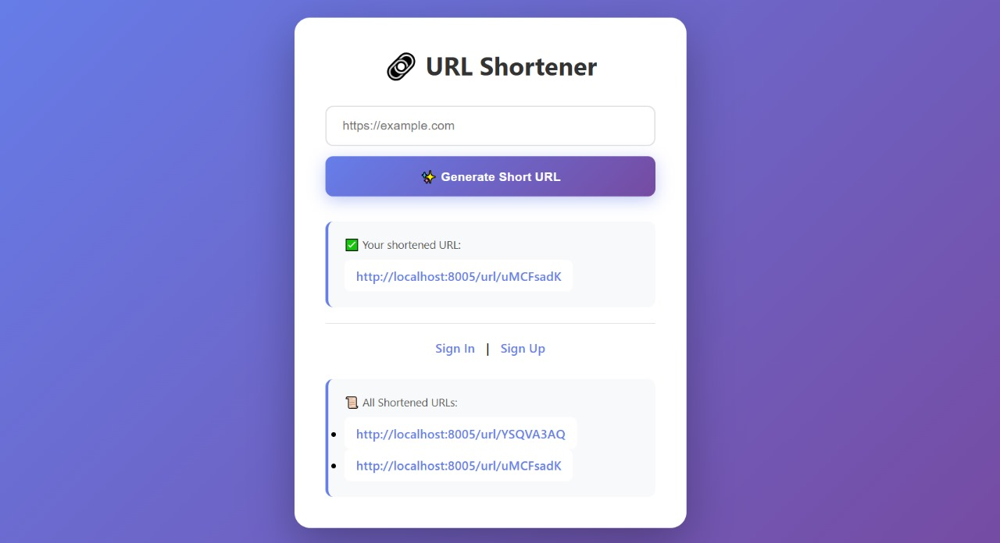
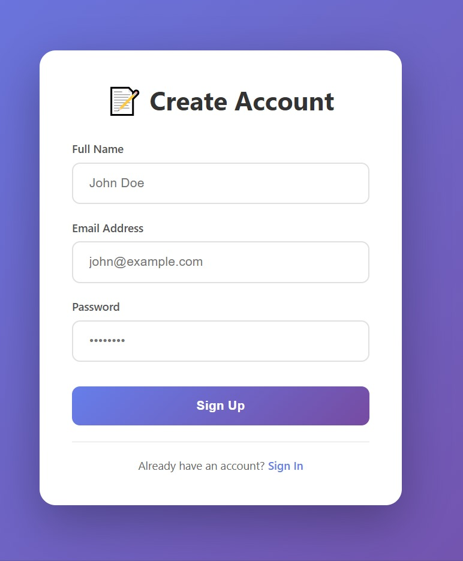
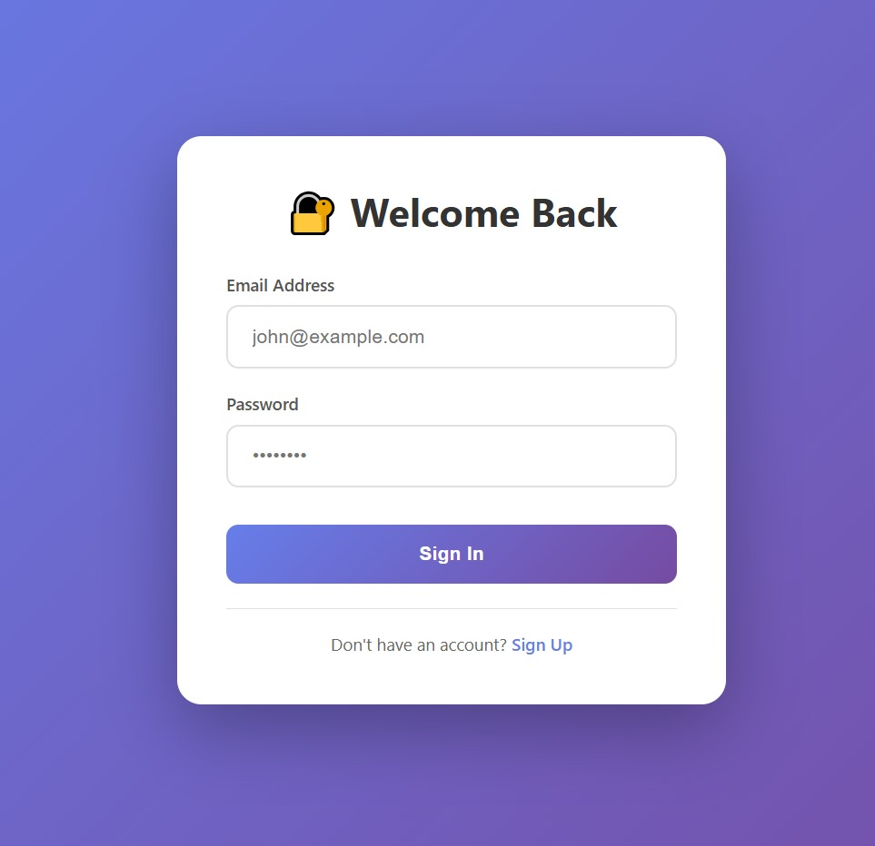

# 🔗 URL Shortener

A modern, full-stack URL shortening application built with Node.js, Express, MongoDB, and EJS. This application allows users to create shortened URLs with user authentication and personal URL management.


## ✨ Features

- 🔐 **User Authentication** - Secure signup and signin functionality
- 🔗 **URL Shortening** - Convert long URLs into short, manageable links
- 👤 **Personal Dashboard** - Each user can view and manage only their own shortened URLs
- 🎨 **Modern UI** - Clean, responsive design with gradient backgrounds and smooth animations
- 📊 **URL Tracking** - View all your created short URLs with timestamps
- 🚀 **Fast Redirects** - Quick redirection to original URLs

## 📸 Screenshots

### Home Page


### Sign Up


### Sign In


## 🛠️ Technologies Used

- **Backend:**
  - Node.js
  - Express.js
  - MongoDB with Mongoose
  - Cookie-Parser for session management
  - UUID for session IDs
  - Nanoid for generating short IDs

- **Frontend:**
  - EJS (Embedded JavaScript Templates)
  - CSS3 with modern gradients and animations

- **Development:**
  - Nodemon for auto-restart during development

## 📋 Prerequisites

Before running this application, make sure you have the following installed:

- [Node.js](https://nodejs.org/) (v14 or higher)
- [MongoDB](https://www.mongodb.com/try/download/community) (running on localhost:27017)
- npm (comes with Node.js)

## 🚀 Getting Started

### 1. Clone the repository

```bash
git clone https://github.com/Ghoshal12345/url-shortener.git
cd url-shortener
```

### 2. Install dependencies

```bash
npm install
```

### 3. Start MongoDB

Make sure MongoDB is running on your local machine:

```bash
# Windows
mongod

# macOS/Linux
sudo systemctl start mongod
```

### 4. Run the application

```bash
npm start
```

The application will start on `http://localhost:8005`

## 📦 Project Structure

```
short-url-practice/
├── controllers/
│   ├── url.js          # URL shortening logic
│   └── user.js         # User authentication logic
├── middlewares/
│   └── user.js         # Authentication middleware
├── models/
│   ├── url.js          # URL schema
│   └── user.js         # User schema
├── routes/
│   ├── staticRoute.js  # Static page routes
│   ├── url.js          # URL-related routes
│   └── user.js         # User authentication routes
├── views/
│   ├── home.ejs        # Home/Dashboard page
│   ├── signin.ejs      # Sign in page
│   └── signup.ejs      # Sign up page
├── connection.js       # Database connection
├── hashmap.js          # Session management
├── index.js            # Main application file
└── package.json        # Dependencies
```

## 🔧 Configuration

### Port Configuration
The application runs on port `8005` by default. You can change this in `index.js`:

```javascript
const PORT = 8005;
```

### Database Configuration
MongoDB connection string is set in `index.js`:

```javascript
connectDB("mongodb://127.0.0.1:27017/short-url-practice");
```

## 📖 Usage

### 1. Create an Account
- Navigate to `http://localhost:8005/signup`
- Enter your name, email, and password
- Click "Sign Up"

### 2. Sign In
- Go to `http://localhost:8005/signin`
- Enter your credentials
- Click "Sign In"

### 3. Shorten a URL
- After signing in, you'll be redirected to the home page
- Enter a full URL (e.g., `https://www.example.com`)
- Click "Generate Short URL"
- Your shortened URL will be displayed

### 4. Use the Short URL
- Click on the shortened URL or copy it
- Share it anywhere
- When accessed, it will redirect to the original URL

### 5. View Your URLs
- All your created short URLs are displayed on the home page
- Only you can see your own URLs (privacy protected)

## 🔐 Authentication Flow

1. User signs up with name, email, and password
2. User signs in with email and password
3. A session ID is generated using UUID
4. Session is stored in a Map with user details
5. Session ID is sent as a cookie to the browser
6. Middleware checks authentication on protected routes
7. Only authenticated users can create short URLs

## 🗄️ Database Schema

### User Schema
```javascript
{
  name: String (required),
  email: String (required, unique),
  password: String (required)
}
```

### URL Schema
```javascript
{
  shortId: String (required, unique),
  redirectUrl: String (required),
  createdBy: ObjectId (reference to User),
  timestamps: true
}
```

## 🌟 Key Features Explained

### URL Generation
- Uses `nanoid` to generate unique 8-character short IDs
- Automatically adds `http://` if protocol is missing
- Stores the creator's user ID for privacy

### Session Management
- Uses in-memory Map for session storage
- Session ID stored in cookies
- Automatic authentication check on protected routes

### Privacy
- Each user can only see their own shortened URLs
- URLs are filtered by `createdBy` field in database queries

## 🎨 UI/UX Features

- Gradient purple background (#667eea to #764ba2)
- Smooth hover animations
- Responsive design for all screen sizes
- Modern card-based layout
- Clear visual feedback for user actions
- Emoji icons for better visual appeal

## 🔒 Security Considerations

**Note:** This is a learning project. For production use, consider:

- Hash passwords using bcrypt
- Use environment variables for sensitive data
- Implement JWT for better session management
- Add rate limiting to prevent abuse
- Use HTTPS in production
- Add CSRF protection
- Validate and sanitize all user inputs
- Use Redis or database for session storage instead of in-memory Map

## 🤝 Contributing

Contributions are welcome! Please feel free to submit a Pull Request.

1. Fork the project
2. Create your feature branch (`git checkout -b feature/AmazingFeature`)
3. Commit your changes (`git commit -m 'Add some AmazingFeature'`)
4. Push to the branch (`git push origin feature/AmazingFeature`)
5. Open a Pull Request

## 📝 Future Enhancements

- [ ] Password hashing with bcrypt
- [ ] Custom short URL aliases
- [ ] Click analytics and statistics
- [ ] QR code generation for URLs
- [ ] URL expiration dates
- [ ] Edit/Delete URL functionality
- [ ] URL validation and safety checks
- [ ] Export URLs to CSV
- [ ] Dark mode toggle
- [ ] Email verification
- [ ] Password reset functionality

## 📄 License

This project is licensed under the ISC License.

## 👨‍💻 Author

**Your Name**

- GitHub: [@yourusername](https://github.com/yourusername)
- LinkedIn: [Your Name](https://linkedin.com/in/yourprofile)

## 🙏 Acknowledgments

- Built as a learning project to understand full-stack web development
- Inspired by services like bit.ly and TinyURL
- Thanks to the Node.js and MongoDB communities

---

**⭐ If you found this project helpful, please give it a star!**

Made with ❤️ by [Your Name]
